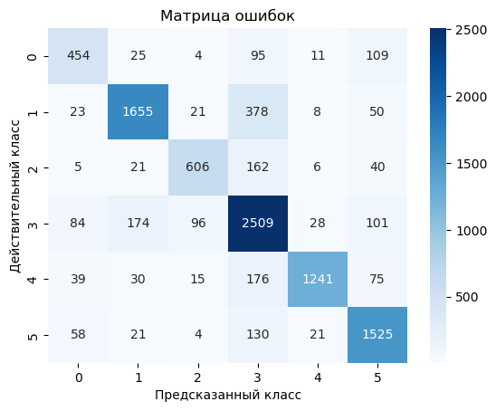
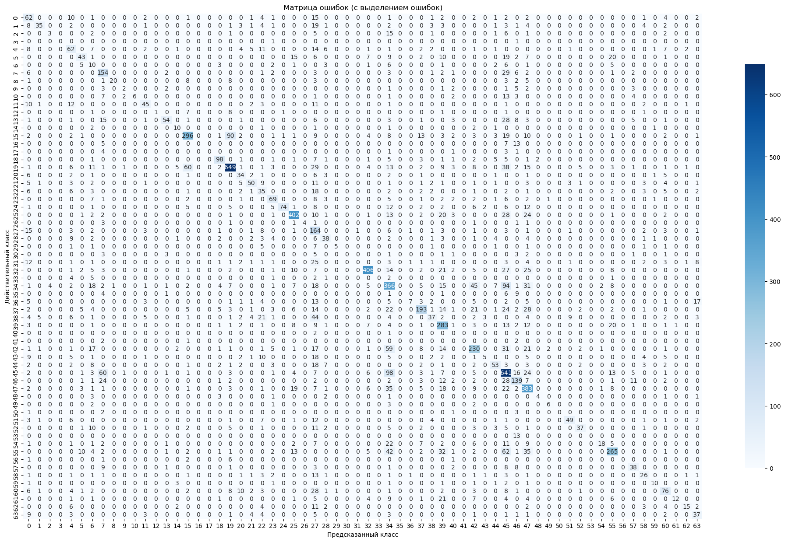
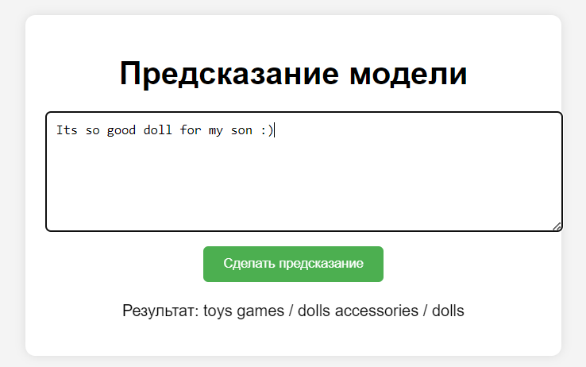

# Результат проекта классификатора отзывов

> Цель: обучить модель предсказывать категорию товара по отзыву на этот товар.

Проделанная работа:

1. Обучил иерархический классификатор на 3 моделях Логистической регрессии.
2. Обучил рекурентную нейронную сеть LSTM.
3. Сравнил метрики у каждой модели.
4. Написал удобный интерфейс с API на Flask

## Обработка данных
1. Препроцессинг текста:
- Нижний регистр
- Токенезация
- Удаление стоп слов
- Лемматизация
2. Создал эмбеддинги TF-IDF
3. Перевел категории в числа через LabelEncoder()
## Обучение иерархического классификатора
```python
class HierarchicalClassifier:
    def __init__(self):
        self.base_classifier_cat1 = LogisticRegression()
        self.base_classifier_cat2 = LogisticRegression()
        self.base_classifier_cat3 = LogisticRegression()

    def fit(self, X_train, y_train_cat1, y_train_cat2, y_train_cat3):
        self.clf_cat1 = self.base_classifier_cat1.fit(X_train, y_train_cat1)
        self.clf_cat2 = self.base_classifier_cat2.fit(X_train, y_train_cat2)
        self.clf_cat3 = self.base_classifier_cat3.fit(X_train, y_train_cat3)
        

    def find_closest_category_tfidf(self, predicted_category, possible_categories):
        tfidf_vectorizer = TfidfVectorizer()
        category_vectors = tfidf_vectorizer.fit_transform(possible_categories + [predicted_category])
        predicted_vector = category_vectors[-1]
        similarities = cosine_similarity(predicted_vector, category_vectors[:-1])
        closest_index = similarities.argmax()

        return possible_categories[closest_index]


    def predict(self, X_test):
        pred_cat1 = []
        pred_cat2 = []
        pred_cat3 = []

        
        for i in X_test:
            predicted_cat1 = self.clf_cat1.predict(i)[0]
            name_cat1 = mapping_cat1[predicted_cat1]
            possible_cat2 = data[data["Cat1"] == name_cat1]["Cat2"].unique()

            predicted_cat2 = self.clf_cat2.predict(i)[0]
            name_cat2 = mapping_cat2[predicted_cat2]

            if name_cat2 not in possible_cat2 and len(possible_cat2) != 0:
                if len(possible_cat2) == 1:
                    name_cat2 = possible_cat2[0]
                else:
                    name_cat2 = self.find_closest_category_tfidf(name_cat2, possible_cat2)

            possible_cat3 = data[data["Cat2"] == name_cat2]["Cat3"].unique()

            predicted_cat3 = self.clf_cat3.predict(i)[0]
            name_cat3 = mapping_cat3[predicted_cat3]

            if name_cat3 not in possible_cat3 and len(possible_cat3) != 0:
                if len(possible_cat3) == 1:
                    name_cat3 = possible_cat3[0]
                else:
                    name_cat3 = self.find_closest_category_tfidf(name_cat3, possible_cat3)

            pred_cat1.append(name_cat1)
            pred_cat2.append(name_cat2)
            pred_cat3.append(name_cat3)

        return pred_cat1, pred_cat2, pred_cat3
```

#### После обучения классификатора получил следующие метрики:

Cat1:
- Accuracy: 0.8329
- Precision: 0.8511713719019832
- Recall: 0.8170608739401382
- F1-score: 0.8318092521531399

Cat2:
- Accuracy: 0.6167
- Precision: 0.6077771157495653
- Recall: 0.42596662861272305
- F1-score: 0.4579642828397469

Cat3:
- Accuracy: 0.4522
- Precision: 0.2770147552067582
- Recall: 0.15886742758372305
- F1-score: 0.17970972324487536

#### Матрица для Cat1:


#### Матрица для Cat2



## Обучение плоского классификатора
```python
# Параметры модели
vocab_size = len(tokenizer.word_index) + 1 # Размер словаря
embedding_dim = 512 # Размерность эмбеддингов
lstm_units = 512 # Количество нейронов в LSTM-слое
num_classes = len(categories) # Количество категорий

# Определение модели LSTM
model = Sequential()
model.add(Embedding(vocab_size, embedding_dim, input_length=max_length))
model.add(Bidirectional(LSTM(128, return_sequences=True)))
model.add(Dropout(0.2))
model.add(Bidirectional(LSTM(64)))
model.add(Dropout(0.2))
model.add(Dense(num_classes, activation='softmax'))

# Компиляция модели
model.compile(loss='sparse_categorical_crossentropy', optimizer=Adam(learning_rate=0.001), metrics=['accuracy'])

# Callback для ранней остановки
early_stopping = EarlyStopping(monitor='val_loss', patience=50, restore_best_weights=True)


model.summary()


model.fit(X_train, y_train, epochs=50, batch_size=256, validation_data=(X_test, y_test),
          callbacks=[early_stopping])
```
#### После обучения классификатора получил следующие метрики:
Cat1:
- Accuracy: 0.7994
- Precision: 0.7992182736654513
- Recall: 0.7923031760014592
- F1-score: 0.795512938624542

Cat2:
- Accuracy: 0.5476
- Precision: 0.4051286416781006
- Recall: 0.3753563977488922
- F1-score: 0.3731162848601761

Cat3:
- Accuracy: 0.4229
- Precision: 0.1410974765196449
- Recall: 0.15022648597519614
- F1-score: 0.13481211062618886


# WEB интерфейс с API на Flask

Я выбрал модель иерархическую модель для API т.к. её метрики чуть чуть лучше.

WEB интерфейс реализовал на Flask.


